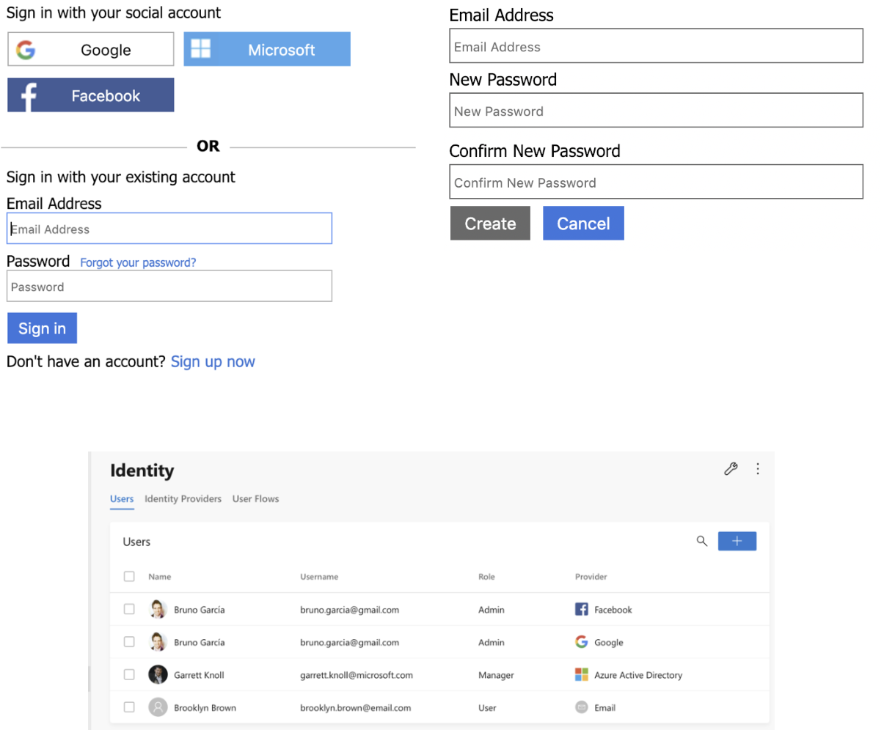
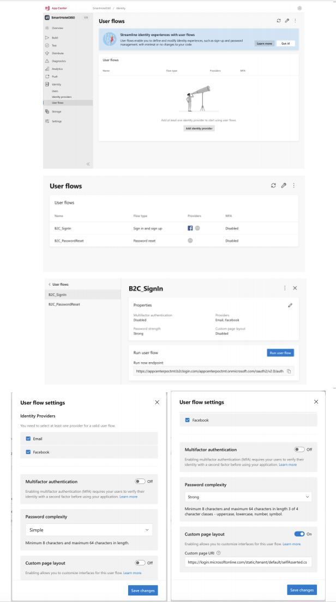

# App Center Identity Spec 

This spec details the App Center Identity service that we will launch a public preview MVP.

## Overview 

### TL;DR 
The goal is to deliver an identity management service in App Center that allows app developers to: 

1. Create and manage an Azure AD B2C resource/tenant in App Center 
2. Configure the Azure AD B2C resource/tenant for the following identity approaches in order of priority: Google, Facebook, Email/Password, Microsoft 
3. View and search for user identities, and the ability to edit in Azure 
4. Use the provided identity to integrate with other services in App Center: 
   - Crashes and analytics events (i.e. Users of the app will be tagged to their crash/analytics data) 
   - Push notifications (i.e. App developers can send push notifications to specific users)
   - Data Storage/GDPR 

## User scenarios 

### Overview 

We are prioritizing the following platforms and providers: 
- Platforms: Android, iOS, Xamarin, React Native
- Provider configuration in App Center Portal (in order of priority):  
  - Google,  
  - Facebook, 
  - Email/password,  
  - Microsoft

- Additional providers can be configured through the B2C tenant directly

Additional platforms will be targeted in the future:
- Windows and PWA/SPA Support

For all the use cases below, app developers need to have an active Azure subscription.

### User scenarios

#### 1. As an app developer, I can provision an Identity service (i.e. Azure AD B2C) for my app.

User experience: 

- Lupita is an app developer who wants to connect her existing Azure subscription to the App Center Identity service. 
- She goes into the App Center Identity service, and she sees a button to “Connect to Azure subscription”. 
- If: 
  - She already has one or more Azure subscription(s) connected to her App Center account,  
    - A panel pops up and she selects which Azure subscription to connect her app to 
  - Else, she is clicks on "+ Add subscription", and she chooses which Azure subscription to connect to and clicks “Connect” 
    - If she does not have an Azure Subscription, she clicks on “Create a subscription” and is redirected to the Azure portal to create a subscription 
- A panel appears for her to input the domain name and choose the country/region to provision the AD B2C tenant/resource. Then, she clicks “Create”. 
  - The domain name is pre-filled with {app-name}.
  - The default for country/region is “United States”. 
- A panel appears with the display text that “Your tenant is being provisioned”. It takes around a minute for an Azure AD B2C tenant/resource to be provisioned. During this time, we will have educational material/text on: 
  - Use cases for Identity integration with other App Center services 
- Lupita lands on the “Getting Started” page where she is taken through sequential steps on how to integrate App Center’s Identity SDK with her app

    

#### 2. As an app developer, I can connect my app to an existing Identity service.

User experience:

- Helmut is an app developer who wants to connect his existing Azure subscription and Azure AD B2C tenant/resource to his app in App Center.
- He goes into the App Center Identity service, and he sees a button to “Connect to Azure subscription”. 
- He chooses the subscription to connect with, and his existing Azure AD B2C tenant to use.
  - He is also given the option to “Create a new subscription” or “Create a new Identity tenant”.
- Helmut lands on the “Getting Started” page where he is taken through sequential steps on how to integrate App Center’s Identity SDK with his app.

    

#### 3. As an app developer, I am able to have a delightful App Center Identity SDK UI experience. 

User Experience: 

- Yolanda has a great app idea to allow her app users to log their fitness activity with their fitness trackers. She would like to get started on the app and track the identity of her users via third-party identity providers. 
- She integrates the App Center Identity SDK and calls appcenter.login() and is provided with a UI that allows her app users to login via third-party identity providers {Google, Facebook, or Microsoft} or email/password. 
  - The UI also allows her to sign up for an account, and this requires the app user to type in their email address and password.  
- Once done,  
  - The user is directed to the URL that Yolanda sets, and the app user can start using her app.
  - The user’s details (name, username, provider) are logged in App Center’s Identity “User” tab 
- The JSON web token (JWT) (and optional refresh token) is passed back from the authorization server (Google, Facebook, or Microsoft) to App Center.  

    

#### 4. As an app developer, I can set up as my identity providers Google, Facebook, Microsoft, and email/password. 

User Experience: 

- Jehad would like to set up third-party identity providers Google, Facebook, or Microsoft, and email/password to authenticate the users of his app. 
- He goes to the App Center Identity service, and clicks on the tab “Identity Providers”, and is presented with the option to configure email/password, or third-party identity providers Google, Facebook, or Microsoft.  
- He chooses to configure Facebook as an Identity Provider. He clicks on the row “Facebook” and is prompted to enter his “Client ID” and “Client Secret”, and clicks “Done” when completed. 

    

#### 5. As an app developer, I can set up and edit the user flows for my identity provider.

User Experience: 
- Sofia is app developer who wants to configure a sign in and sign up user experience for her app users.  
- She goes to the App Center Identity service, and clicks on the tab “User Flows”. 
- She is able to choose from the four types of default user flows that App Center Identity provides: Sign up and Sign in, Password reset, Sign-up, and Sign-in. 
- For each of the user flows, she can: 
  - Select the Identity Providers that she has already configured. If she has no Identity Providers configured, she will see an empty state reminding her to configure the providers. 
  - Choose to toggle multi-factor authentication on or off. 
  - If she has email/password set up, there will be an additional box for her to toggle her settings for “Password complexity”. 
  - She will have the option to configure the “Advanced settings” in the Azure portal.
  - Clicking on each user flow, she can choose to customize her UI by toggling `on` for `Custom page layout` and inserting a URL where her custom UI exists.

    

#### 6. As an app developer, I view a list and search for the app users authenticated to the app.

User Experience: 

- As an app developer, I can see a list of app users who have authenticated to my app or are users under my Azure AD B2C tenant. If I’d like to have more granular control over the users, I will edit the users in Azure.
- On the main page under “Users”, I will be able to search for the users based on email, and first name and last name.
- When I click on each of the users, I see their basic profile. To have more granular control over the editing of the users, I am directed to Azure.

#### 7. As an app developer, the changes or API calls I make in/to the Azure AD B2C portal is similarly captured in the App Center Identity portal and pushed to the config file of the app. 

Any changes that the app developer makes in App Center Identity will be reflected in Azure AD B2C, and vice versa.

#### 8. As an app developer, I am able to use my app user’s identity to integrate with other App Center services. 

We will have integration in the back-end for: 
- Crashes and analytics events (i.e. Users of the app will be tagged to their crash/analytics data) 
- Push notifications (i.e. App developers can send push notifications to specific users) 
- Data Storage/GDPR 
