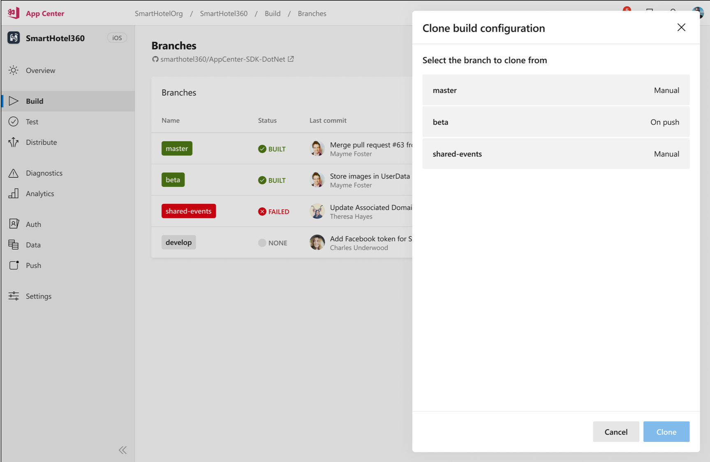
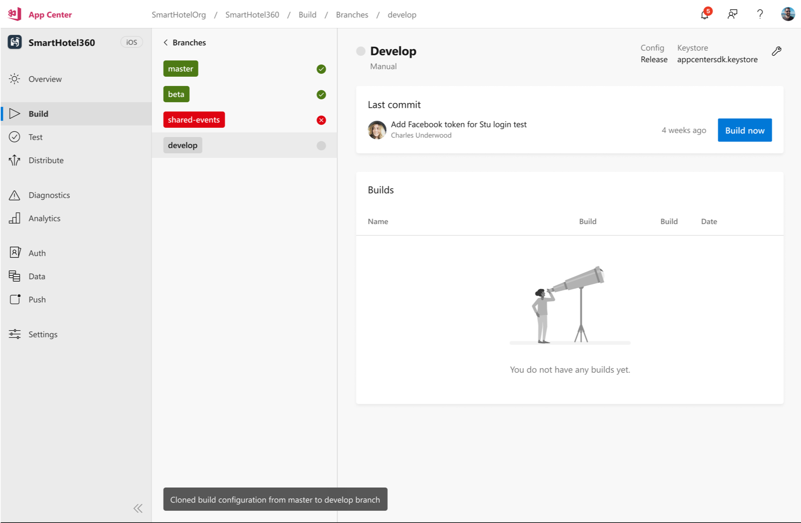
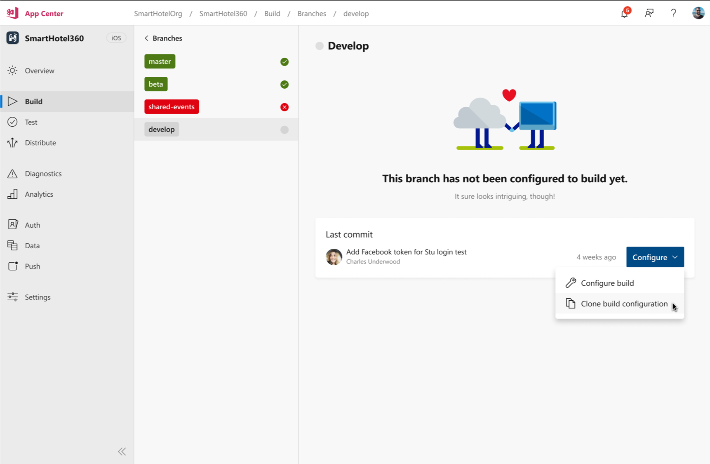
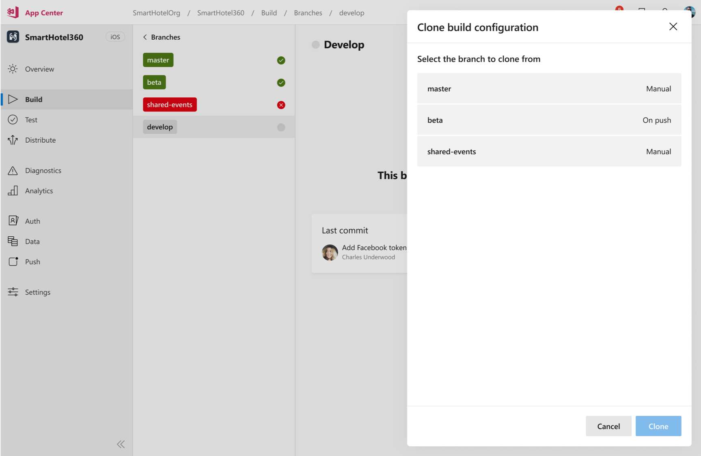
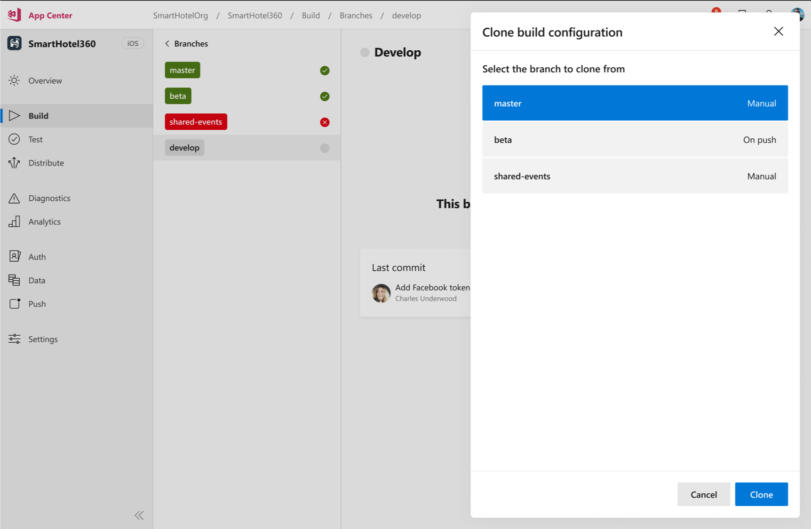
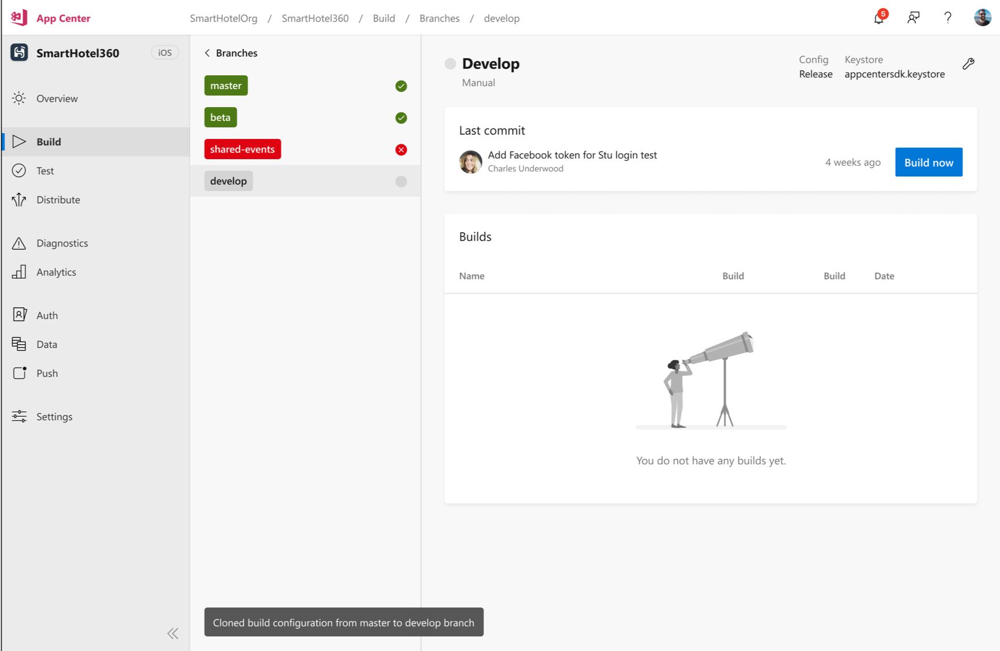

# App Center Build Clone Branch Configuration Proposal

This proposal details the approach the App Center team will take to address a heavily voiced frustration regarding branch configurations. We expect to start work on implementing this feature in the second quarter of 2019.

## Problem Statement

Currently, each time a new branch needs to be configured, one has to configure it completely from scratch. Existing configurations are not available for re-use. This is especially cumbersome for a branch configuration with many environment variables and when dealing with the management of signing credentials. Building a new branch via API today requires full configuration of the branch and uploading secrets.

## Goal

Given that at least one branch is already configured for a specific app, one can clone a configured branch’s configuration and apply it to a non-configured branch.

## Solution

### UI Experience
* After navigating to a branch configuration page, an icon will be visible to clone a different branch’s configuration and apply it to the current branch.
* App Center Build will populate existing build configurations to clone.
* App Center will clone the following from a configured branch’s configuration:
	* Build settings – Includes toolset versions, build triggers, version number, and launch tests.
	* Environment variables – Variable names and values will be cloned. This includes encrypted environment variables.
	* Signing credentials – Stored signing credentials will be cloned along with passwords for the credentials.
	* Build scripts – Build script settings will be cloned and applied. If the build script no longer exists in the repo, the build may fail.
	* Distribution settings – Distribution to users, group, or store destinations will be cloned.
* After selecting a configuration to clone,  App Center will automatically apply and save the configuration to the new branch. Changes can be made to the new branch configuration after the cloned configuration is saved.

### Designs

There will be two entry points for cloning a branch configuration to a new branch.

#### Cloning from the Branch List Page

For unconfigured branches in the branch list, clicking the three-dot icon will reveal two options where there was previously a single click icon. The new option is to clone a build configuration.

After choosing to clone a build configuration, all existing branches with build configurations will be populated as configuarations to copy.

An existing configuration should be selected and confirmed.

A notification will show the clone was successful, and the newly configured branch is available to build.

#### Cloning from the Branch Build Details Page

For an unconfigured branch, clicking the **Configure** button will reveal two options where there was previously a single click button. The new option is to clone a build configuration.

After choosing to clone a build configuration, all existing branches with build configurations will be populated as configuarations to copy.

An existing configuration should be selected and confirmed.

A notification will show the clone was successful, and the newly configured branch is available to build.

### API Experience

To be shared

## Limitations and Out of Scope

* After a branch configuration is cloned, changes on one branch will not keep settings in sync with cloned branch configurations.
* Default branch configuration is out of scope of this solution.
* Applying a cloned configuration will be limited to branches that have not been previously configured.