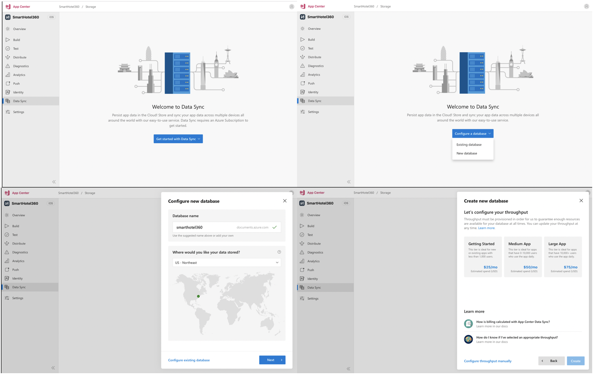

# Data Sync Overview

The Data Sync MVP service will initially provide basic functionality to persist app data in the cloud. This service will be built on top of Cosmos DB. Our core functionality will include:

- The ability to provision or connect to a Cosmos DB instance to store app data with an Azure subscription (Core SQL protocol only)
- The ability to create two types of documents (all documents exist in a single collection for now):
  - Public (and read only)
  - Private (and read-write by a single authenticated user via AAD B2C)
- The ability to perform Read operations on global/shared settings with our native SDKs
- The ability to perform CRUD operations on user data with our native SDKs
- The ability to perform CRUD operations on global/shared settings through the App Center UI
- The ability to perform CRUD operations on User data through the App Center UI
- On device caching for offline data persistance (i.e. Store and Forward)
- The ability to view utilization metrics in the App Center Portal

In addition to the core functionality, our MVP will also have event listeners, which will wait for an event to occur and programmatically react to to an input or signal.

### Offline capabilities 

For our MVP, we will have a basic "Store and Forward" implementation, which will be expanded on in the future to include conflict resolution callbacks, which will enable developers to define logic and behavior in the case of a conflict.

**Reads:** Guaranteed to get latest cached document if offline, and throws an error otherwise

**Writes:** Last write wins (no conflict resolution callback for now). Writes are persisted immediately if online and later if offline. A global hook can be defined to no be notified when documents are actually persisted remotely.  We plan on implementing a conflict resolution callback for this in the future.

In regards to caching, our current plan involves implementing an on-device caching system.  It will be a SQLite dedicated file/database for Data Storage. The service will have two tables for caching documents. One per application for app documents and one per application, per user, for user documents.

We'll be introducing a per-document Time-To-Live (TTL) setting for reads and writes. TTL controls whether or not a document should be cached and for how long.

We don't currently have plans to enforce a size limit.

### Security

For security, we're implementing a token exchange service. This will allow an exchange of an app secret plus an optional AAD B2C token for a Cosmos DB resource token. This service is responsible for validating app secrets, validating AAD B2C tokens, creating Cosmos DB users (for each AAD B2C user), associating default permissions for each Cosmos DB user, and caching and returning resource tokens. This will eventually be tightly coupled with our [Identity Service](https://github.com/Microsoft/appcenter/pull/16) in order to give better access control, permissions, and other identity functionality in correlation with Data Sync.

### Platform Support

We have decided to prioritize the following platforms:

- Android
- iOS

Additional platforms that we will target in the future:

- Xamarin
- React Native
- .NET Core
- JavaScript (browser)

### Going Forward

Additional features we plan on implementing following the initial release:

- A more enhanced data persistence experience, including a conflict resolution callbacks for both online and offline scenarios.
- Shared documents between authenticated users.
- Support for multiple collections
- Real-time updates, expanding on our current functionality of updates starting on app start, on resume, or when the developer manually syncs.
- Consent Removal, giving developers a more robust flow capable of Configuring Cosmos DB view/edit permissions for App Center users

## MVP User Scenarios

#### 1. As a developer, I can provision a Cosmos DB instance for storing my app data 

- I can link to an existing Azure subscription and create a new Cosmos DB resource. I can specify the Database name and location of the data through a dropdown menu. After doing so, i'm able to select which tier of data i'm going to use. We recommend starting with the "Getting Started" tier to get an understanding of basic usage/pricing and how [Cosmos DB RUs](https://docs.microsoft.com/azure/cosmos-db/request-units) work.

#### 2. As a developer, I can connect an existing Cosmos DB database for use with the Data Sync service

- Directly from the App Center portal, i'm able to connect an existing Cosmos DB instance via Azure subscription. By connecting my Azure subscription to my app, I can select a database and existing collection I would like to connect my app to.

- Directly from the App Center portal, i'm able to connect an existing Cosmos DB instance through via connection string. Instead of opting to use your Azure subscription, I can insert my database connection string and specify my database and existing collection I would like to connect my app to.

#### 3. As a developer, I can  disconnect my app from a connected Cosmos DB database for with the Data Sync service

#### 4. As a developer, I can easily navigate to the Azure Cosmos DB resource from the App Center portal to view and edit my app data

- I can easily context switch from the App Center to the Cosmos DB database in the Azure portal using the "Open in Azure" button located in the App Center portal.

#### 5.As a developer, I can view and perform CRUD operations on my app data using the App Center Data Sync SDK and the App Center Portal

- I can view all of my app data in a list view
- I can create, get/read, update, and delete documents
- I can delete an entire collection and all the documents in it

#### 6. As a developer, I can perform read operations on my global/shared settings in the App Center Data Sync SDK and CRUD operations through the App Center portal

#### 7. As a developer, I can view utilization metrics associated with my data
  

