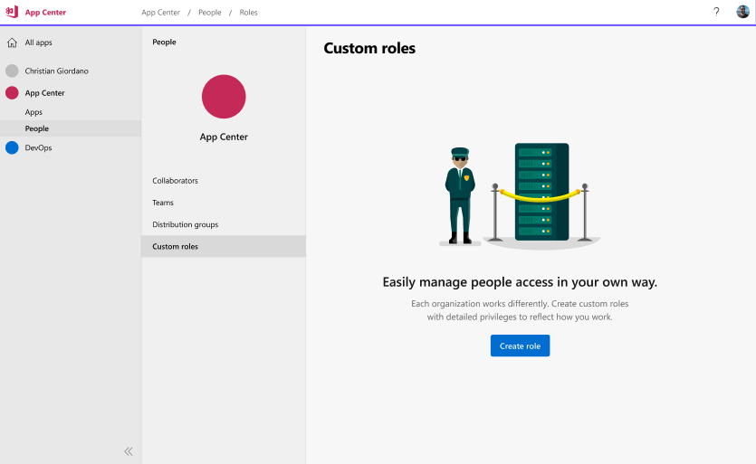
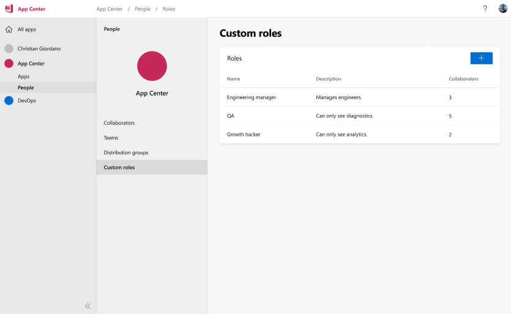
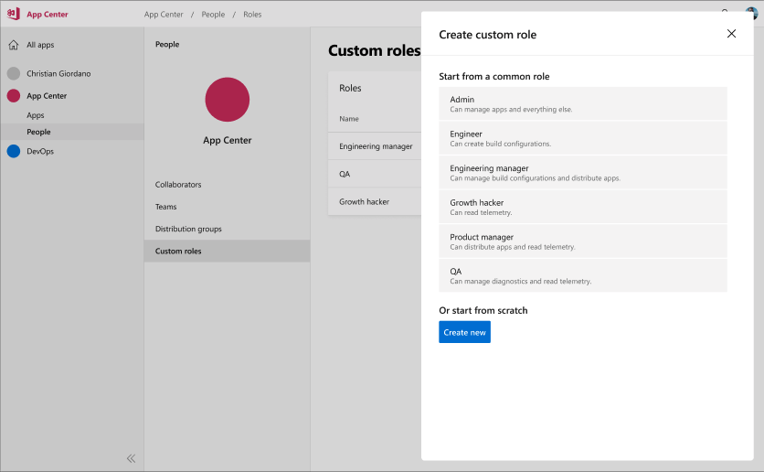
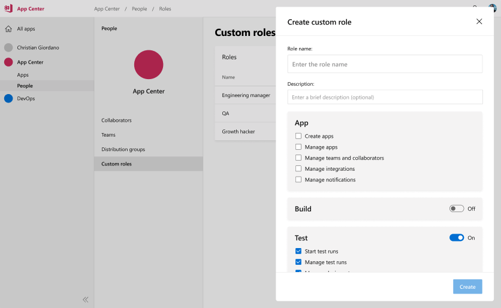
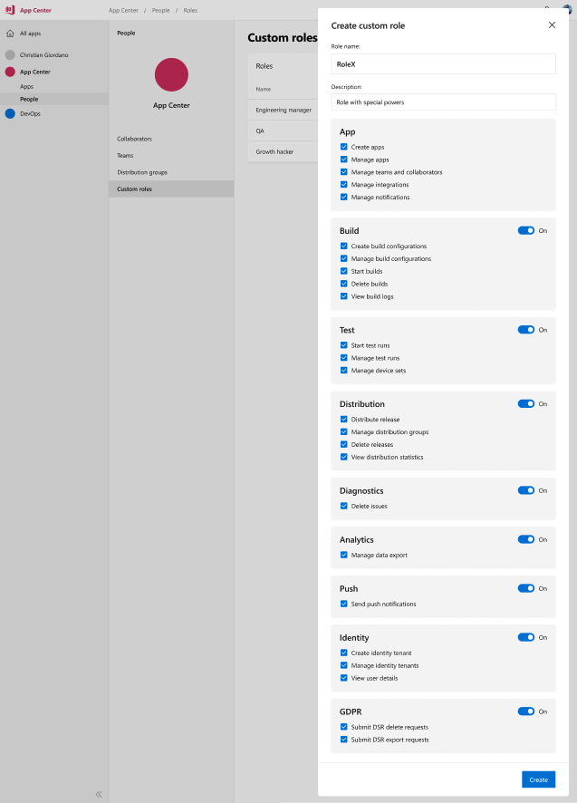

# Overview

App Center has roles that can only be applied broadly across all the services within the portal and through the API's.

## Built-in Roles Today

There are currently two categories of roles within App Center, Organization roles and Team roles. Team roles determine app permissions which define what a user can do with an app's configuration and data, but we frequently hear requests for more options.

### Organization Roles

There are three roles within an organization, which determine access across all apps and settings within an organization.

* Admins manage the settings of an organization (name, permissions, billing configuration). They also automatically have 'Manager' level app permissions for all apps within the Org.
* Collaborators are able to create apps, making them the manager of that app, and create teams within an Organization. Collaborators only work within apps they own or have been explicitly added to.
* Members may not create or view Shared Distribution Groups or Teams. They also may only work within apps they have been explicitly added to.

### Team Roles

Teams exist within the context of an Organization, and a single organization can have multiple teams. Your role within a team determines what a user can do with an apps configuration and data.

* Managers can manage app settings, collaborators, and integrations
* Developers can manage app services (e.g. create builds, run tests)
* Testers can install apps they are distribution group members of
* Viewers access is limited to a read-only state for all app data

# Goals

Introduce new role based access controls for App Center services, user scenarios, and functionality with a strong focus on ease of use over maximum granularity.

# Scenarios

## Roles

1. Admins can create, update and delete additional roles
2. Admins cannot create, update and delete the 4 built-in default roles
3. Admins can edit a roles permissions

## Role Permissions

Custom roles will include the ability to include or exclude access to a specific service along with a permission set focused on functionality within the service itself.

### Apps

 1. Apps can be created
 2. Apps can be deleted
 3. Can manage Teams & Collaborators
 4. Can set up integrations (services, webhooks, export)
 5. Can remove integrations (services, webhooks, export)
 6. Can manage all notification settings

### Build

 1. Can create build configuration
 2. Can delete build configuration
 3. Can start a build
 4. Can delete a build
 5. Can view build logs

### Test

  1. Can start test run
  2. Can view test run
  3. Can delete test run
  4. Can manage device sets

### Distribution

  1. Can distribute release
  2. Can manage distribution groups
  3. Can delete release
  4. Can view distribution statistics

### Diagnostics

  1. Can (re)-open, edit, close or delete issues
  1. Can view diagnostics

### Analytics

  1. Can view analytics
  2. Can manage export

### Push

  1. Can send push messages

### Identity

  1. Can create identity tenant
  2. Can configure identity tenant
  3. Can delete identity tenant
  4. Can view user details

# GDPR

  1. Can submit DSR delete requests
  2. Can submit DSR export requests

## Teams

With an existing `Team` structure already in place the assumption is this serves as a logical fit for security group management.

1. Admins can create a `Team` and limit the services members have access to see
2. Admins can create a `Team` and limit functionality within a service members have access to use

## App Security

1. Admins can lock down an app to users belonging to a specific corporate domain
2. Admins can lock down an org to users belonging to a specific corporate domain
3. Admins can secure app releases behind an authenticated web address

## Audit

1. Admins, developers and viewers can view an audit trail of actions performed by users within an app or org

# Mockups
Default view when no custom roles have been created:

List view of custom roles you've created underneath your org or app:

Create a new role from a few predefined templates:

Modify access to services and management features:

Granular permissions across all App Center services:

